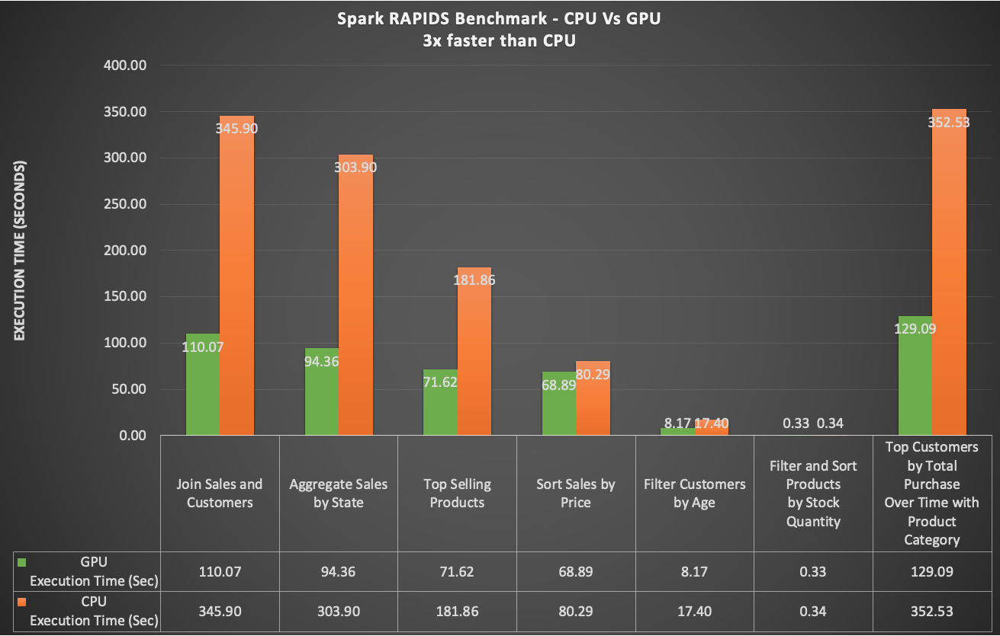
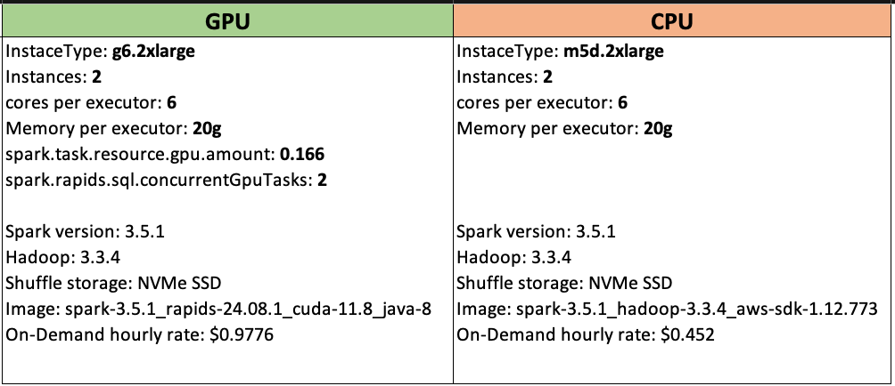
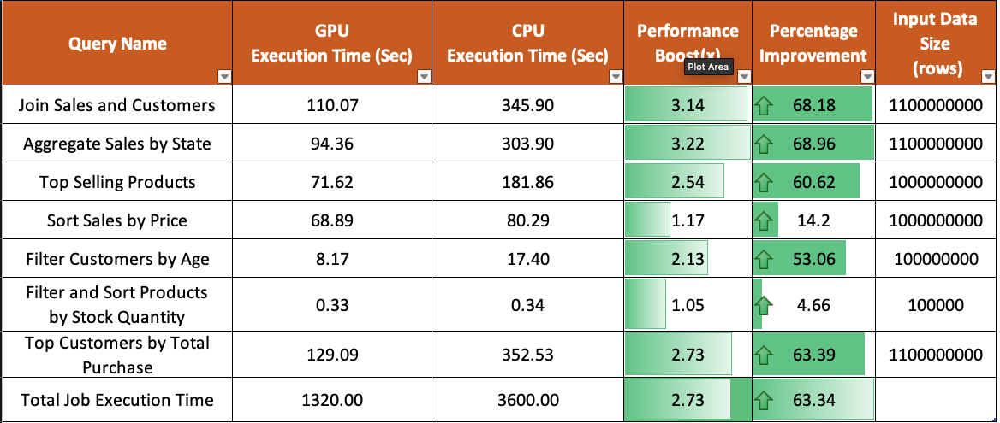

# Spark RAPIDS Benchmark Execution 🚀

This guide provides a step-by-step process to run Spark RAPIDS benchmarks on both CPUs and GPUs. It includes detailed instructions on how to configure, execute, monitor, and compare the results efficiently. The benchmarks will help you assess performance improvements when using GPUs for data processing and machine learning predictions.

Here’s an example of the benchmark results:



## Pre-requisites ⚙️

Before you begin, ensure that the following steps are completed:

**Step1: Generate Test Data 📝**

Before executing the benchmarks, you need to generate the necessary test data. This data will be stored in an S3 bucket and will be used to configure the Spark Operator for both CPU and GPU jobs.

Follow this [data generation guide](https://kubedai.github.io/spark-rapids-on-kubernetes/docs/Benchmarks/data-generation) for detailed steps on how to generate the data.

**Step2: Upload the PySpark Script to S3 💾**

Upload the benchmark script to the S3 bucket using the following command:

Replace `<S3_BUCKET>` with your actual S3 bucket name.

```bash
aws s3 cp benchmarks/benchmark/spark-rapids-benchmarks.py s3://<S3_BUCKET>/benchmark/scripts/
```

## Execute Benchmark on CPUs 🖥️

**Step 1: Update S3 Bucket in the Benchmark File 📂**

 - Navigate to the root directory of the repository.
 - Open the file `benchmarks/benchmark/benchmark-cpu.yaml`.
 - Replace `<S3_BUCKET>` with the actual S3 bucket name.
 - Save the file.

**Step 2: Run the Benchmark Script 🚀**

From your terminal, execute the benchmark job:

```bash
kubectl apply -f benchmarks/benchmark/benchmark-cpu.yaml
```

**Step 3: Monitor the Job Execution 👀**

Monitor the running pods by checking the job status:

```bash
kubectl get pods -n data-eng-team
```
You should see one driver pod and two executor pods. 

:::info

The job might take over an hour to complete.

:::

**Step 4: Verify the Output Results 📊**

Once the job succeeds, find the results in `s3://<S3_BUCKET>/benchmark/output/cpu`

Open the file and review the results.

You can also monitor the job in real-time using the Spark History Server:

```bash
kubectl port-forward svc/spark-history-server -n spark-history-server 8080:80
```

Then, open http://localhost:8080 in your browser.

After verifying the results, delete the CPU job to free up resources:

```bash
kubectl delete -f benchmarks/benchmark/benchmark-cpu.yaml
```

## Execute Benchmark on GPUs 🖥️💡

**Step 1: Update S3 Bucket in the Benchmark File 📂**

 - Navigate to the root directory of the repository.
 - Open the file `benchmarks/benchmark/benchmark-gpu.yaml`.
 - Replace `<S3_BUCKET>` with the actual S3 bucket name.
 - Save the file.

**Step 2: Run the Benchmark Script 🚀**

From your terminal, execute the benchmark job:

```bash
kubectl apply -f benchmarks/benchmark/benchmark-gpu.yaml
```

**Step 3: Monitor the Job Execution 👀**

Monitor the running pods by checking the job status:

```bash
kubectl get pods -n data-eng-team
```

You should see one driver pod running on a CPU and two executor pods running on GPU instances such as `g5/g6.2xlarge`.

:::info

The job might take around 22 mins to complete.

:::

**Step 4: Verify the Output Results 📊**

Once the job succeeds, find the results in `s3://<S3_BUCKET>/benchmark/output/gpu`

Open the file and review the results.

You can also monitor the job in real-time using the Spark History Server:

```bash
kubectl port-forward svc/spark-history-server -n spark-history-server 8080:80
```

Then, open http://localhost:8080 in your browser.

After verifying the results, delete the CPU job to free up resources:

```bash
kubectl delete -f benchmarks/benchmark/benchmark-gpu.yaml
```

## Benchmark Results

Here’s a closer look at the benchmark test configuration:



This chart shows a comparison between CPU and GPU benchmark performance:



From these results, you can clearly see the performance gains when using GPUs for data processing and machine learning predictions.

## Final Thoughts 💡

Congratulations! 🎉 You’ve successfully executed and compared Spark RAPIDS benchmarks on both CPUs and GPUs. Continue fine-tuning your configurations and exploring further optimizations to improve performance and cost-efficiency.
