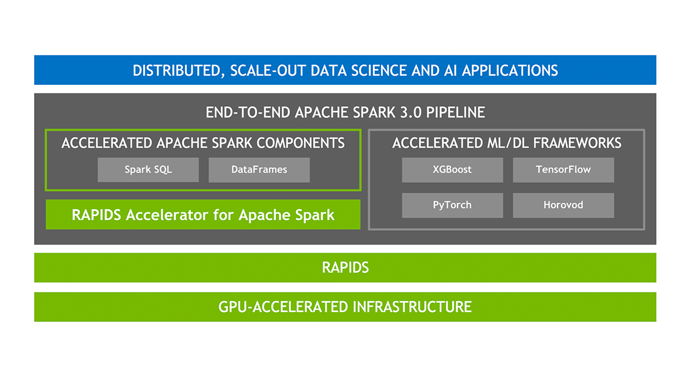

import siteConfig from '/docusaurus.config.ts';
import CodeBlock from '@theme/CodeBlock';

# Getting Started with ⚡ Apache Spark RAPIDS ⚡

Apache Spark RAPIDS, also known as RAPIDS Accelerator for Apache Spark is a powerful tool that builds on the capabilities of NVIDIA CUDA® - a transformative parallel computing platform designed for enhancing computational processes on NVIDIA's GPU architecture.
Apache Spark RAPIDS leverages GPUs to accelerate processing of Apache Spark workloads via the [RAPIDS libraries](http://rapids.ai/), enabling high-performance, distributed data processing for data science workflows at scale.

By merging the capabilities of the RAPIDS cuDF library and the extensive reach of the Spark distributed computing ecosystem, the RAPIDS Accelerator for Apache Spark provides a robust solution to handle large-scale computations. Moreover, the RAPIDS Accelerator library incorporates an advanced shuffle optimized by UCX, which can be configured to support GPU-to-GPU communication and RDMA capabilities, hence further boosting its performance. By using RAPIDS, you can perform data science, machine learning, and analytics tasks faster by offloading processing to GPUs, significantly reducing the runtime of complex Spark jobs.

With Spark RAPIDS, large-scale data processing is transformed, delivering near real-time insights for big data applications across industries.

## 🌟 Key Features of Spark RAPIDS

The **Apache Spark RAPIDS Accelerator** enables Apache Spark to leverage the power of NVIDIA GPUs, accelerating big data processing with minimal code changes. Below are some of the standout features that make Spark RAPIDS a powerful tool for data scientists, engineers, and analysts alike:

### **🚀 GPU-Accelerated SQL Queries**

With Spark RAPIDS, SQL query execution is offloaded to the GPU, enabling faster data processing for operations like:

- **Joins**
- **Aggregations**
- **Sorts**
- **Group By**
- **Window Functions**

This results in significant reductions in query runtime, allowing data to be analyzed more quickly.

### 🛠️ Support for a Wide Range of Spark APIs

Spark RAPIDS supports a broad set of core Apache Spark APIs, ensuring that most of your Spark jobs can be GPU-accelerated, including:

- **DataFrame API**
- **SQL API**
- **RDD-based operations**

This allows for seamless integration with existing Spark applications with minimal code refactoring.

### 🔄 GPU-Accelerated Shuffle Operations

The **RAPIDS Shuffle Manager** replaces Spark’s default shuffle mechanism with a GPU-accelerated version, which dramatically speeds up data movement between partitions. This improves performance during stages like:

- **MapReduce operations**
- **Joins**
- **Windowing**

The GPU-accelerated shuffle reduces CPU and memory overhead, resulting in faster execution times.

### 💡 Advanced Memory Management

Spark RAPIDS efficiently manages GPU memory, allowing for:

- **Zero-copy data transfers** between CPU and GPU memory.
- **Memory spilling** to host memory or disk when GPU memory limits are reached.
- **Optimized memory usage** across multiple operations to prevent bottlenecks and crashes.

These optimizations ensure efficient and scalable resource usage when working with large datasets.

### 📊 Seamless Integration with Existing Spark Workflows

One of the key strengths of Spark RAPIDS is its ability to integrate with existing Spark workflows. Users can:

- **Run Spark workloads with minimal changes** by using the same DataFrame, SQL, and RDD APIs.
- Easily **switch between CPU and GPU execution** by simply configuring the environment for GPU support.
- Enjoy compatibility with **Spark on-premise** and **cloud-based clusters** like Databricks, Google Dataproc, and Amazon EMR.

### 🔧 Full Support for Spark MLlib

Spark RAPIDS accelerates various machine learning algorithms in **Spark MLlib**, leveraging GPU-optimized versions of common algorithms such as:

- **k-means clustering**
- **Random forests**
- **Decision trees**
- **Linear regression**

This boosts the performance of machine learning pipelines, enabling faster training and evaluation times for large datasets.

### 📦 Plug-and-Play with Existing Infrastructure

The Spark RAPIDS Accelerator can be used in a wide variety of environments, including:

- **On-premises** clusters with NVIDIA GPUs
- **Cloud-based platforms** like AWS, GCP, and Azure
- **Managed services** like Databricks, Google Dataproc, and Amazon EMR

This flexibility allows organizations to easily incorporate GPU acceleration without overhauling their infrastructure.

### 🖥️ Multi-GPU and Multi-Node Scaling

Spark RAPIDS scales across multiple GPUs and nodes, providing:

- **Horizontal scalability** for large datasets distributed across multiple machines.
- **Multi-GPU parallelism** within a single node to maximize the performance of individual tasks.

This scaling ability makes it ideal for processing massive datasets in distributed computing environments.

### 🔍 Extensive Logging and Debugging Tools

Spark RAPIDS includes built-in **logging** and **metrics** to track the performance of GPU-accelerated tasks. This helps users:

- **Monitor GPU usage and performance**.
- **Identify bottlenecks** and optimize execution plans.
- **Debug errors** through detailed logs that help trace potential issues in GPU-accelerated operations.

### 🧠 GPU-Accelerated Machine Learning Inference

In addition to MLlib training, Spark RAPIDS supports **inference on GPUs** for large-scale machine learning models. By leveraging GPU acceleration, organizations can perform inference tasks, such as predictions and classifications, with significantly reduced latency.

As the use of artificial intelligence (AI) and machine learning (ML) continues to expand in the realm of data analytics, there's an increasing demand for rapid and cost-efficient data processing, which GPUs can provide. The NVIDIA RAPIDS Accelerator for Apache Spark provides powerful features and enables users to harness the superior performance of GPUs, leading to substantial infrastructure cost savings.

## 📚 Additional Resources

- [Apache Spark RAPIDS Documentation](https://nvidia.github.io/spark-rapids/)
- [NVIDIA RAPIDS Overview](https://rapids.ai/)
- [Spark RAPIDS GitHub](https://github.com/NVIDIA/spark-rapids)
